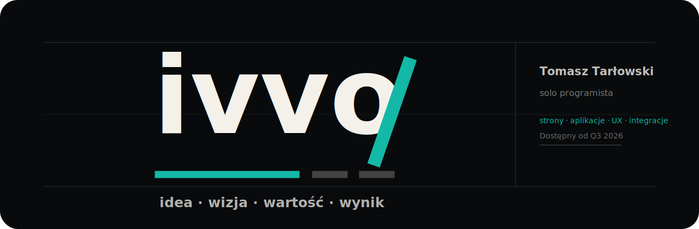

  

<h1 align="center">Tomasz Tarłowski</h1>

  <strong>Creative Developer</strong> · founder of <a href="https://ivvo.pl">ivvo</a> · Warsaw / remote EU
   
  I design and ship product-grade web apps, MVPs, and premium landing pages for founders and focused teams.

  
  
  

  

---

### What I Build

I turn early product ideas into polished, working software: interface, frontend, backend glue, deployment, and the details that make a product feel serious.

- **MVPs in 4-8 weeks**: product flows, dashboards, auth, payments, integrations, admin surfaces.
- **Premium landing pages in 1-2 weeks**: custom design, conversion-focused copy structure, fast frontend, tasteful motion.
- **Product systems**: internal tools, SaaS foundations, content platforms, AI-assisted workflows.
- **One person across design and code**: fewer handoffs, faster iteration, clearer ownership.

### Stack

  
  
  
  
  
  
  
  

### Public Work

<!-- profile:public-work:start -->
<!-- Generated by scripts/update-profile.mjs -->

<strong>5</strong> original public repos · <strong>Python · Swift</strong> · refreshed 29 April 2026

<table>
<tr>
<td width="50%" valign="top">
  <a href="https://github.com/tomasztarlowski/NEWIVVO"><strong>NEWIVVO</strong></a>
   Public ivvo workspace for product-facing web work, brand experiments, and high-polish frontend direction.
   Product studio · updated 24 Apr 2026
</td>
<td width="50%" valign="top">
  <a href="https://github.com/tomasztarlowski/maccleaner-pro"><strong>maccleaner-pro</strong></a>
   Native macOS cleaner built with SwiftUI: large files, duplicates, leftovers, developer junk, and bilingual UI.
   macOS app · Swift · updated 19 Mar 2026
</td>
</tr>
<tr>
<td width="50%" valign="top">
  <a href="https://github.com/tomasztarlowski/NTFSonMAC"><strong>NTFSonMAC</strong></a>
   Python utility work around NTFS workflows on macOS.
   Developer utility · Python · 1 star · updated 18 Apr 2026
</td>
<td width="50%" valign="top">
  <a href="https://github.com/tomasztarlowski/WiFi-ESP32--Scanner"><strong>WiFi-ESP32--Scanner</strong></a>
   ESP32 Wi-Fi scanning playground for hardware/network experiments.
   Hardware · updated 11 Apr 2026
</td>
</tr>
<tr>
<td width="50%" valign="top">
  <a href="https://github.com/tomasztarlowski/proteaAI"><strong>proteaAI</strong></a>
   AI and service automation prototype space.
   AI prototype · updated 11 May 2025
</td>
<td width="50%" valign="top"></td>
</tr>
</table>

Source: <a href="https://github.com/tomasztarlowski?tab=repositories">GitHub repositories</a>. Forks are intentionally hidden here so the profile leads with original work.
<!-- profile:public-work:end -->

### Current Focus

- Building **ivvo** as a compact product studio for founders and premium brands.
- Shipping sharper public examples: native macOS tools, AI workflows, hardware experiments, and product-facing web systems.
- Keeping my GitHub readable: fewer random dumps, more useful READMEs, clearer project positioning.

### Work With Me

Best fit: a founder or small team that needs someone who can think through product, design the interface, and ship the working build.

- Website: [ivvo.pl](https://ivvo.pl)
- Contact: [hello@ivvo.pl](mailto:hello@ivvo.pl)
- Quick call: [WhatsApp](https://wa.me/48502202286)
- FAQ: [ivvo.pl/faq](https://ivvo.pl/faq)

<strong>Polski opis</strong>

Buduję kompletne produkty webowe dla founderów i marek premium: od idei, przez interfejs, po wdrożenie. Najczęściej są to MVP, landing page'e premium, dashboardy, narzędzia wewnętrzne i aplikacje z integracjami.

Pracuję jako jedna osoba na styku designu i developmentu, więc projekt ma mniej przekazań, szybsze decyzje i spójniejszy efekt końcowy.

---

  
    <a href="https://ivvo.pl">ivvo.pl</a>
    ·
    <a href="https://ivvo.pl/about">about</a>
    ·
    <a href="https://ivvo.pl/uslugi">services</a>
    ·
    <a href="https://ivvo.pl/faq">FAQ</a>
    ·
    <a href="https://ivvo.pl/kontakt">contact</a>
  

