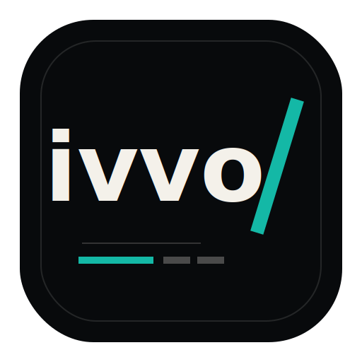

  Tomasz Tarłowski · solo programista · Warszawa
   
  strony · aplikacje · UX · integracje
   

  
  

  

---

### Hej

Robię strony, aplikacje i automatyzacje.

Najchętniej takie, które mają przestać być „pomysłem na później” i po prostu zacząć działać.

### Robię

- szybkie MVP
- strony premium
- aplikacje webowe
- integracje i automatyzacje
- ratowanie projektów, które utknęły
- UX, performance, SEO/GEO

### Jak pracuję

Krótko: gadamy, ustalamy sens, robię plan, piszę kod, wdrażam.

Bez wielkiego zespołu i bez głuchego telefonu. Jedna osoba trzyma temat od początku do końca.

### Stack

  
  
  
  
  
  
  

### Repo

<!-- profile:public-work:start -->
<!-- Generated by scripts/update-profile.mjs -->

<strong>5</strong> publicznych repo · <strong>Python · Swift</strong> · 01 czerwca 2026

<table>
<tr>
<td width="50%" valign="top">
  <a href="https://github.com/tomasztarlowski/NEWIVVO"><strong>NEWIVVO</strong></a>
   Tu dłubię przy IVVO: strona, copy, UX i system.
   IVVO · akt. 24 kwi 2026
</td>
<td width="50%" valign="top">
  <a href="https://github.com/tomasztarlowski/maccleaner-pro"><strong>maccleaner-pro</strong></a>
   Macowa apka do sprzątania dużych plików i dev-śmieci.
   macOS · Swift · akt. 19 mar 2026
</td>
</tr>
<tr>
<td width="50%" valign="top">
  <a href="https://github.com/tomasztarlowski/NTFSonMAC"><strong>NTFSonMAC</strong></a>
   Małe narzędzie do NTFS na macOS.
   narzędzie · Python · 1 ★ · akt. 18 kwi 2026
</td>
<td width="50%" valign="top">
  <a href="https://github.com/tomasztarlowski/WiFi-ESP32--Scanner"><strong>WiFi-ESP32--Scanner</strong></a>
   ESP32, Wi-Fi i trochę zabawy z siecią.
   hardware · akt. 11 kwi 2026
</td>
</tr>
<tr>
<td width="50%" valign="top">
  <a href="https://github.com/tomasztarlowski/proteaAI"><strong>proteaAI</strong></a>
   Prototypy AI i automatyzacje usług.
   AI · akt. 11 maj 2025
</td>
<td width="50%" valign="top"></td>
</tr>
</table>

Forki chowam. Tu pokazuję swoje rzeczy z <a href="https://github.com/tomasztarlowski?tab=repositories">GitHuba</a>.
<!-- profile:public-work:end -->

### Kontakt

Masz temat? Napisz krótko, co chcesz dowieźć.

- [hello@ivvo.pl](mailto:hello@ivvo.pl)
- [ivvo.pl](https://ivvo.pl)
- [WhatsApp](https://wa.me/48502202286)

---

  
    <a href="https://ivvo.pl">Start</a>
    ·
    <a href="https://ivvo.pl/o-tomaszu">O Tomaszu</a>
    ·
    <a href="https://ivvo.pl/uslugi">Usługi</a>
    ·
    <a href="https://ivvo.pl/kontakt">Kontakt</a>
  

